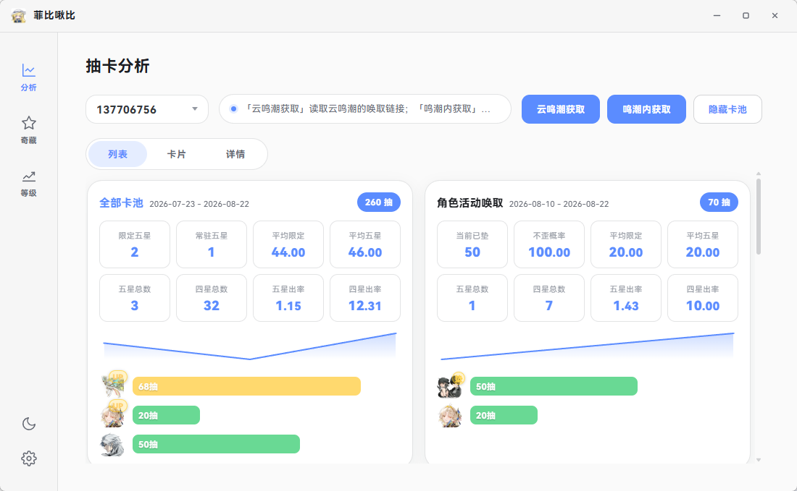
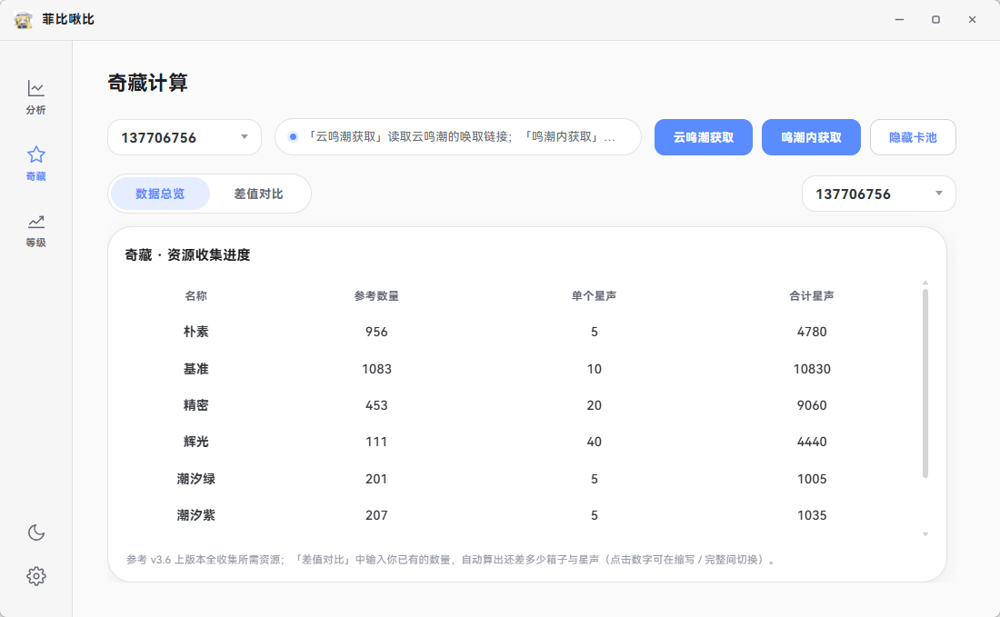
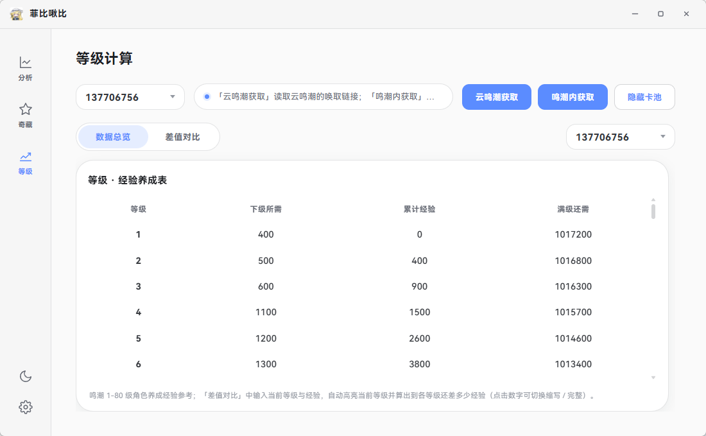
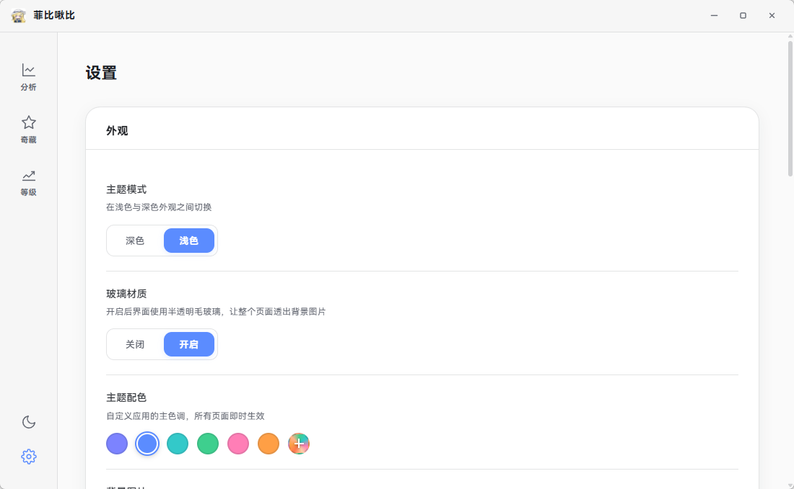

# 菲比啾比 · FeibiJiubi

> 一款基于 Electron 的《鸣潮》**唤取（抽卡）记录分析工具**。
> 自动读取本机游戏客户端的唤取记录，生成概率、保底、垫抽、奇藏与养成等级的可视化分析报告。数据**本地读取、本地存储、本地分析**，永不出本机。


---

## ✨ 功能特性

### 🎴 唤取分析
- **自动读取**：从本机库洛启动器 / 鸣潮客户端的本地登录态捕获唤取链接，调用官方接口拉取全部卡池记录（角色 / 武器 / 常驻 / 忆旅等）
- **手动兜底**：唤取链接过期时，可在设置页直接粘贴唤取 URL 解析，无需依赖游戏日志
- **多维度统计**：出货概率、保底进度、垫抽情况、星级分布、限定 / 常驻区分，条形、卡片、详情三种视图自由切换
- **UP 一目了然**：条形视图为当期 UP 五星打标，限定卡池「歪」与「不歪」清晰可辨

### 🗺️ 奇藏与养成
- **奇藏同步**：复用启动器本地登录态，实时同步游戏内奇藏（收藏）数据
- **等级养成**：按角色对照展示等级与经验差值，差值输入框支持纯数字快速录入
- **账号一键切换**：启动即列出启动器登录过的全部账号（国服 + 国际服），记住上次选中账号，重启自动恢复

### 🎨 界面体验
- **极光玻璃 UI**：精致通透的玻璃拟态界面，深色 / 浅色主题 + 自定义主色
- **响应式布局**：列表进度条按实际比例分配宽度，高分屏 DPI 自适应

### 🔒 隐私与安全
- **纯本地运行**：数据仅存于本机数据库，不存在任何远程上传 / 数据外发逻辑
- **隔离加固**：`contextIsolation` + `contextBridge`，渲染进程无 Node 权限
- **开源透明**：MIT 协议开源，全部代码可审计

---

## 📸 界面预览

> 以下为实际运行截图，展示当前最新版本界面效果。

| 唤取分析 | 奇藏计算 |
|---|---|
|  |  |

| 等级养成 | 设置页 |
|---|---|
|  |  |

---

## 🚀 快速开始

### 方式一：直接下载（推荐）

前往 [GitHub Releases](https://github.com/Untsia/FeibiJiubi/releases) 下载最新版本：

| 产物 | 说明 |
|---|---|
| `FeibiJiubi-<版本>-windows-x64-setup.exe` | NSIS 安装包，支持自定义安装目录、覆盖升级 |
| `FeibiJiubi-<版本>-windows-x64-portable.exe` | 便携版，免安装解压即用 |

> 未签名安装包可能触发 SmartScreen 提示，点击「更多信息 → 仍要运行」即可。

### 方式二：从源码运行

```powershell
# 1. 克隆仓库
git clone https://github.com/Untsia/FeibiJiubi.git
cd FeibiJiubi

# 2. 安装依赖
npm install

# 3. 开发模式启动（热加载窗口）
npm start
```

> **国内网络加速**：若 `npm install` 下载 Electron 二进制过慢或超时，配置国内镜像后重装即可（无需关闭 TLS 证书校验）：
>
> ```powershell
> npm config set electron_mirror https://registry.npmmirror.com/-/binary/electron/
> npm install
> ```

---

## 🛠️ 开发指南

### 环境要求

| 依赖 | 要求 | 说明 |
|---|---|---|
| 操作系统 | Windows 10 / 11 | 当前打包目标仅 Windows |
| Node.js | **24.x** | 请勿降级，历史版本存在兼容问题 |
| npm | 随 Node 附带 | — |

### 常用命令

| 命令 | 作用 |
|---|---|
| `npm start` | 开发模式启动应用 |
| `npm test` | 运行全量单元 / 冒烟测试（`node --test`） |
| `npm run build` | 清理并打包，产物输出至 `dist/`（NSIS 安装包 + 便携版） |

### 构建产物与自动更新

- 打包产物位于 `dist/`，同时生成 `latest.yml` 与 `.blockmap`（增量更新元数据）
- 自动更新走 GitHub Releases 渠道：主进程查询仓库最新 Release，通过版本比较守卫仅在确有新版本时提示，支持增量下载 + 静默安装
- 发布方式：为 `main` 分支打 tag 并创建 GitHub Release，上传上述产物即可

### 代码签名（可选）

上架应用商店需要代码签名证书，通过环境变量注入（避免私钥入库）：

```powershell
$env:CSC_LINK = "C:\path\to\your\code-signing.pfx"
$env:CSC_KEY_PASSWORD = "your-cert-password"
npm run build
```

> 未设置环境变量时自动跳过签名，仍可生成安装包用于本地测试。

---

## 🏗️ 技术架构

| 模块 | 选型 | 说明 |
|---|---|---|
| 运行时 | Electron 33 | 主进程 + 原生渲染进程，**无前端框架**（HTML/CSS/JS） |
| 数据存储 | better-sqlite3 | 运行期数据库（唤取记录 / 设置 / 缓存） |
| 图表 | Chart.js | 本地打包副本，不引入 npm 依赖 |
| 网络 | axios | GitHub Releases 更新检查、唤取接口请求 |
| 配置持久化 | 原生 `ipcMain` + 数据库设置表 | 无第三方状态库 |

### 核心数据流

```
主进程 (src/core)
  ├─ main.js                窗口 / 托盘 / 生命周期 / 更新检查
  ├─ services/analysisGacha 唤取记录抓取与解析（官方接口）
  └─ services/kujiequTreasure.js   奇藏 / 等级数据同步

渲染进程 (src/renderer)
  └─ gachaWuwa.js           唤取分析主逻辑（统计 / 视图渲染 / 同步）
        │  contextBridge (preload.js)
        ▼
  原生 HTML/CSS/JS 界面（Aurora Glass 设计体系）
```

### 项目结构

```
src/
├── core/                    主进程业务逻辑
│   ├── app/                 日志 / 数据库 / 数据目录
│   └── services/            抽卡分析 / 奇藏 / 设置 / 背景
└── renderer/                渲染进程
    ├── views/               分析页 / 设置页
    ├── styles/              全局设计 Token 与各页样式
    └── scripts/             页面逻辑与工具
```

完整结构详见 [`PROJECT_STRUCTURE.md`](./PROJECT_STRUCTURE.md)。

---

## 🔐 数据与隐私

- 所有数据（唤取记录、奇藏、等级、设置）仅存储于本机数据库：
  `%APPDATA%\feibijiubi\FeibiJiubi\`
- 「检查更新」仅请求 GitHub Releases 公开接口，不携带任何身份信息
- 本项目**不收集、不上传、不追踪**任何用户数据，详见 [`PRIVACY.md`](./PRIVACY.md)

---

## ❓ 常见问题

**Q：为什么点击获取却拉不到数据？**
A：请确认本机已安装鸣潮客户端 / 库洛启动器并登录过游戏；若唤取链接过期，可在设置页「唤取获取方式」切到「手动输入 URL」粘贴链接。

**Q：账号下拉框里没有我的国际服账号？**
A：下拉框列出启动器登录过的全部账号（国服 + 国际服），若仍未出现，先确认该账号在本机登录过。

**Q：会修改游戏文件吗？会被封号吗？**
A：工具只做本地读取与分析，不修改任何游戏文件。但使用第三方工具仍可能违反《用户协议》，相关风险需自行评估（详见免责声明）。

**Q：如何完全删除数据？**
A：卸载后删除 `%APPDATA%\feibijiubi\` 目录即可。

---

## 📦 更新日志

完整更新记录见 [`release-notes.md`](./release-notes.md)。版本节奏：

- **v1.5.x**：列表视图四星数量角标、移除渐变背景、主题切换优化、大幅清理无用代码
- **v1.4.x**：账号记忆恢复、统计修正、界面与同步体验优化
- **v1.3.x**：新增列表视图、唤起获取方式（自动 / 手动 URL）、卡片详情增强
- **v1.2.x**：启动器账号自动发现、更新链路与安装体验修复
- **v1.0.0**：初始开源版本

---

## 🤝 贡献

欢迎提交 Issue 与 PR。请确保：

1. 提交前通过 `npm test`
2. 文案遵循项目术语约定
3. 涉及界面改动时保持 Aurora Glass 设计体系一致

---

## ⚠️ 免责声明

1. 本项目**仅供个人学习与数据分析使用**，所有唤取记录均从用户**自有**的游戏客户端本地读取，数据仅保存在本机，开发者不收集任何用户数据。
2. 使用本工具可能**违反游戏《用户协议》/ 服务条款**中关于第三方工具的相关规定，由此产生的账号风险、封禁等后果由使用者**自行承担**。
3. 本项目与游戏开发商（库洛游戏 / KURO GAMES）及任何官方机构**无任何关联**，并非官方产品，亦未获得官方授权或背书。
4. 如游戏官方明确要求停止使用，请立即停止使用并删除本软件。

---

## 📄 开源许可

本项目以 **MIT 许可证** 开源。详见 [`LICENSE`](./LICENSE)。

---

## 🙏 致谢

- 唤取记录读取方式参考社区通用做法（基于官方唤取接口）
- 图表展示使用 [Chart.js](https://www.chartjs.org/)
- 感谢所有提出建议与贡献代码的社区用户
